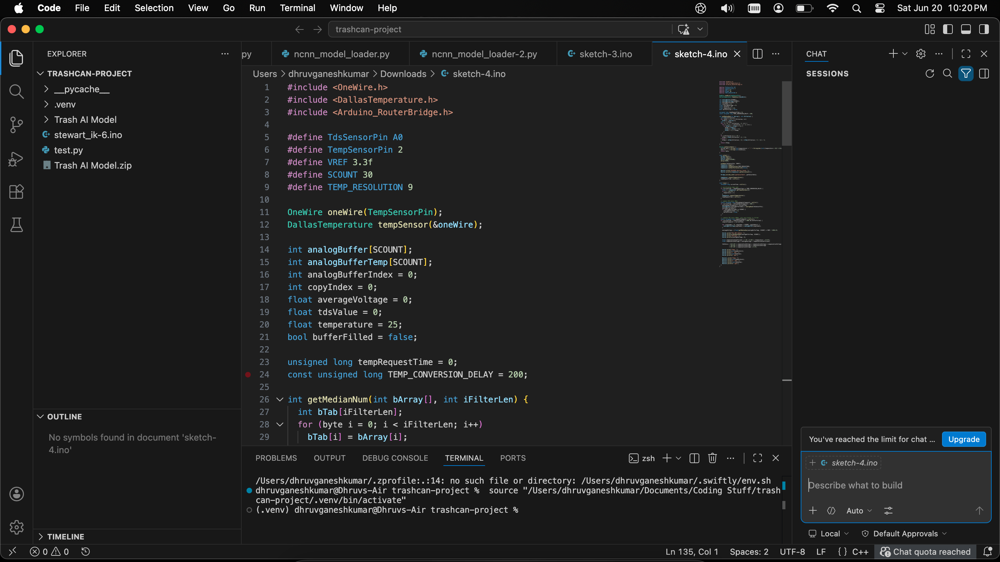

# AutoSort — Build Journal

A running log of design decisions, breakthroughs, and dead ends building an autonomous trash sorting robot for Stardance + more stuff upcoming!!

This was written by AI because I was unaware that I had to make a journal, but I reviewed all the content. **NONE OF THE CAD OR MECHANICS WAS AI GENERATED, ONLY THE CODE WHICH I HAVE NOT LOGGED TIME FOR.**
Onshape(Versions show iterations): [text](https://cad.onshape.com/documents/374a3ea9606b4332d25f084a/w/b8f0205f0cfaa6895c93c91e/e/6ee7d91d01f9acebc8ed9dcf?renderMode=0&uiState=6a374abe34d5cf692fd58173)
---

## Early Concept & Stewart Platform v1
**~2 weeks ago | 27m logged**

First working concept: a Stewart platform mounted on a rotating turret. The idea was simple — classify trash with YOLOv8, spin to face the right bin, tilt to eject.

Testing revealed two immediate problems:
- Small/light items (paper, receipts) didn't slide off the bowl surface — not enough friction differential
- Larger items slid off too fast and unpredictably

Ejection behavior turned out to be way harder to tune than expected. Went back to CAD.

---

## New Sorting Mechanism — Slotted Queue System
**~10 days ago | 4h 52m logged**

Reworked the whole sorting approach. New design is larger and introduces **4 individual slots**, each operated by an MG90 servo. The idea is each slot holds one piece of trash in a queue, and the Stewart platform works through them sequentially.

This came after realizing the v1 single-item approach was too sensitive to item geometry. A slotted queue gives more control over item positioning before classification and ejection.

Still figuring out the best geometry for the slot-to-platform interface.

---

## Bin Redesign — Industrial Layout
**~1 day ago | 3h 43m logged**

Scrapped the previous bin arrangement and reworked it completely. New layout surrounds the central platform with bins on all sides — similar to an industrial waste station — rather than having bins offset below.

Key improvements:
- Bins are now way easier to remove (just lift straight up)
- Packaging is cleaner — the whole unit is more self-contained
- Easier to demonstrate at competition without bins falling out mid-demo

CAD complete. Moving to first print.

---

## Mechanical Architecture (Current)

| Subsystem | Details |
|---|---|
| Base motion | Stewart platform, 3× MG996R servos, 38mm arms / 53mm pushrods |
| Rotation | DC motor + gear reduction, lazy Susan bearing, rotary encoder |
| DOF | 4 total (3 tilt + 1 spin) |
| Bowl | 220mm diameter, PETG |
| Bins | 180×180×180mm, 120° apart, lift-out design |
| Input | 4 servo-actuated flaps (MG90) on static outer ring |
| Sealing | TPU rim on flap edges to bridge bowl-to-bin gap |

---

## Electronics & Firmware

- **PCA9685** PWM driver mounted on the rotating platform — only I2C + power cross the slip ring joint
- **Slip ring** handles continuous rotation without winding up wires
- **IK solver** written in C++ on Arduino — went through 3 firmware iterations fixing linker errors, struct ordering bugs, and light-object ejection compensation
- **YOLOv8** classification pipeline running on host, result passed to Arduino for actuation
- Multi-object queue implemented in firmware for sequential sorting

---

## Time Logged

| Session | Time |
|---|---|
| v1 Stewart platform test | 27m |
| Slotted queue redesign | 4h 52m |
| Bin layout rework | 3h 43m |
| **Total** | **~9h 2m** |