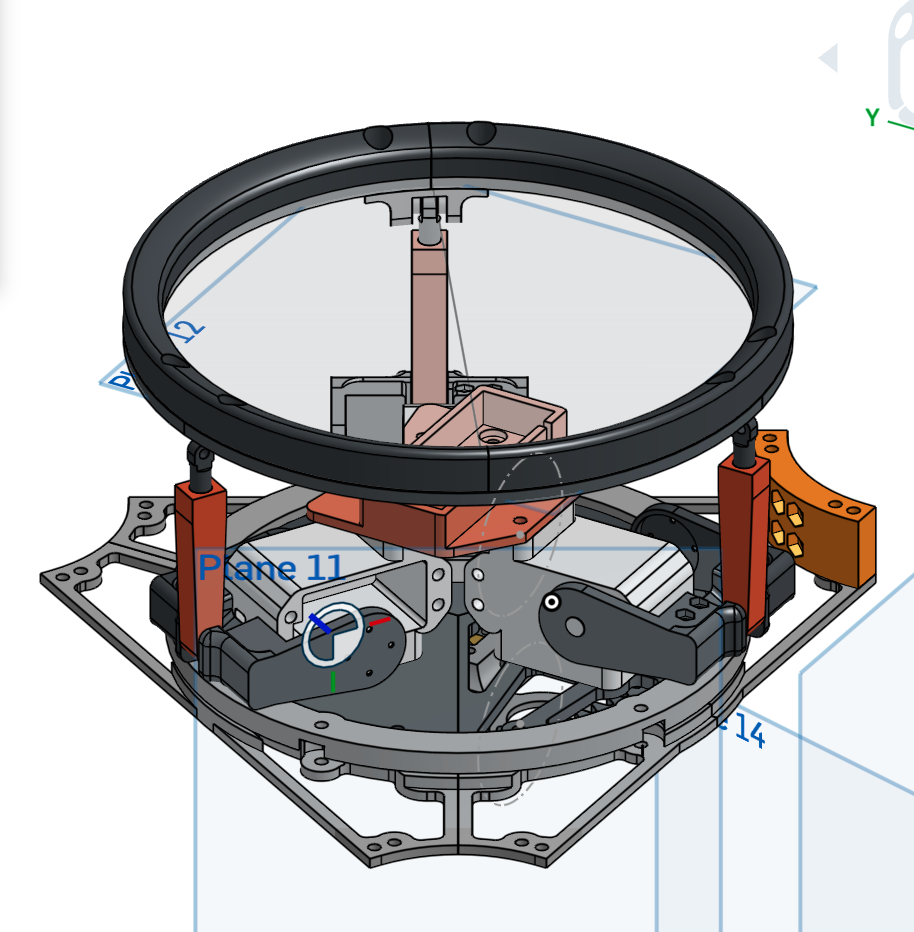
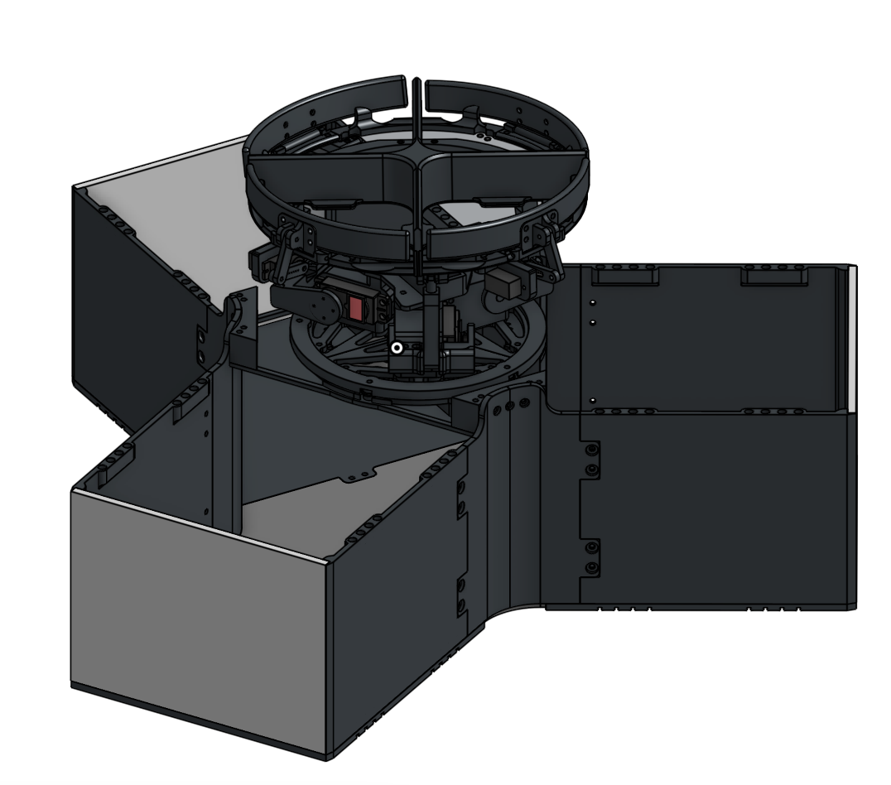
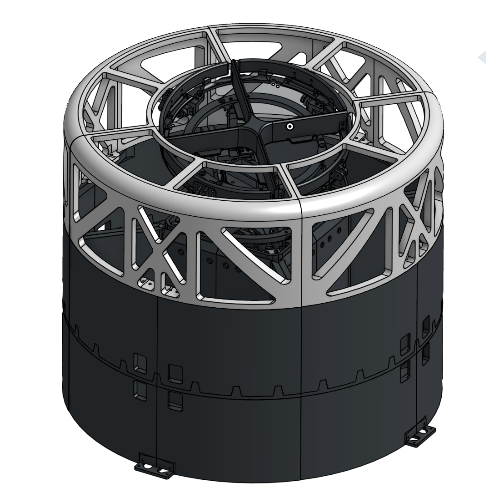
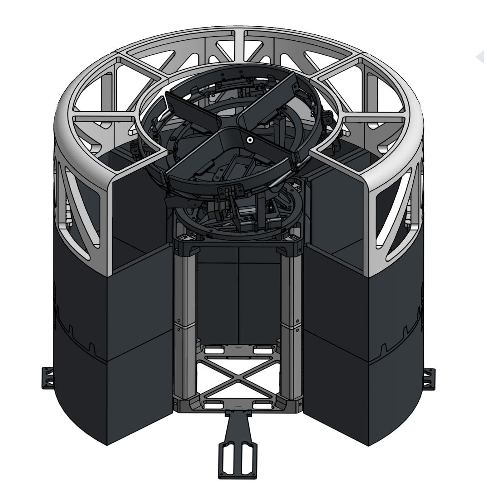

# AutoSort — Build Journal

A running log of design decisions, breakthroughs, and dead ends building an autonomous trash sorting robot for Stardance + more stuff upcoming!!

Onshape(Versions show iterations): [text](https://cad.onshape.com/documents/374a3ea9606b4332d25f084a/w/b8f0205f0cfaa6895c93c91e/e/6ee7d91d01f9acebc8ed9dcf?renderMode=0&uiState=6a374abe34d5cf692fd58173)
---

## First brainstroming
This idea came to me last year, when I was coming back home after going to visit my relatives abroad. I saw a random airport employee throw a cigaratte into the recycling bin in a sparklingly new airport. I then started to think of how irresposible people were with waste management. As someone who has witnessed waste management systems first hand(I visited a sewage/organics processing center once 😭) I know how important it is for people to sort their trash correctly. So, I made this thing so it would become hopefully effortless!!

## Early Concept & Stewart Platform v1
**~2 weeks ago | 27m logged**

This was the first working prototype. It's pretty simple. I was thinking that I would be able to control the amount of tilt and have the objects fall off easily one by own. Of course, this was not the case. There was too much friction, and the object kept on getting stuck. 

I ran a lot of physical testing here with a physical prototype(currently taken apart to test the new stuff!!) but it didnt work.

---

## New Sorting Mechanism — Slotted Queue System
**~10 days ago | 4h 52m logged**

Reworked the whole sorting approach. New design is larger and introduces **4 individual slots**, each operated by an MG90 servo. The idea is each slot holds one piece of trash in a queue, and the Stewart platform works through them sequentially.

I found this approach to be the only effective way to do it. I made everything as smooth as possible, trying the reduce the opportunities for the object to get stuck on.

I tested an 3 box type trashcan packaging here, thinking it would be the best way to do it. But, I made the bins too small, and the aesthethic and packaging was horrible, so I started brainstroming better ways to do this to replace this layout.

---

## Bin Redesign — Industrial Layout
**~1 day ago | 3h 43m logged**

Scrapped the previous bin arrangement and reworked it completely. New layout surrounds the central platform with bins on all sides — similar to an industrial waste station — rather than having bins offset below.

Key improvements:
- It doesn't look as ugly
- Bins are quarter-bins 19in in diameter instead of just a miniscule 180^3.
- Easier to keep in a room
- Easy to remove bins without removing an entire 'door' as you needed to do before.

CAD complete. Moving on to first print(I'm actually testing and iterating on some of the parts rn due to small design issues such as not accounting for servo wires 😭 but all those issues **are fixed currently!!**)

## Time Logged

| Session | Time |
|---|---|
| v1 Stewart platform test | 27m |
| Slotted queue redesign | 4h 52m |
| Bin layout rework | 3h 43m |
| **Total** | **~9h 2m** |
